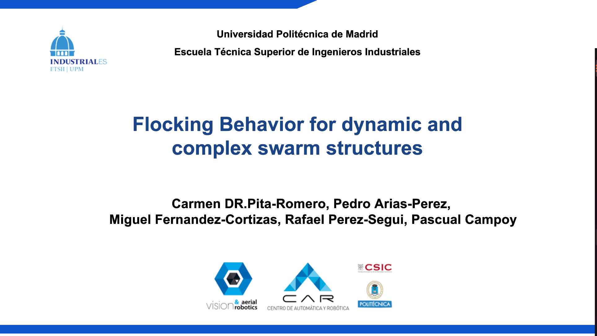

<p align="center">
  <h1 align="center">Flocking behavior for dynamic and complex swarm structures </h1>
    <p align="center">
    <a href=><light>Carmen DR.Pita-Romero</light></a>
    ·
    <a href=><light>Pedro Arias-Perez</light></a>
    ·
    <a href=><light>Rafael Perez-Segui Miguel Fernandez Cortizas</light></a>
    .
    <a href=><light>Rafael Perez-Segui </light></a>
    ·
    <a href=><light>Pascual Campoy</light></a>
    ·
  </p>
 <h3 style="text-align: center;">
  <a href="#">In Progress Paper</a> | 
  <a href="https://vimeo.com/cvarupm/flocking-behavior">Video</a>
</h3> 
</p>

<br>

<p align="center">
  <a href="">
    
  </a>
</p>


## [TABLE OF CONTENTS](#table-of-contents)
- [Summited Paper ](#summited-paper-for-icuas25)
- [Getting started](#getting-started)
- [Launch simulation mission](#Launch-simulation-mission)
- [Launch aunch real mission](#Launch-aunch-real-mission)
- [Maintainers](#maintainers)


## Summited Paper for ICUAS25

<p align="center">
  <a href="https://vimeo.com/cvarupm/flocking-behavior">
    
  </a>
</p>

## Getting started
This project has been developed in Ubuntu 22.04, ROS 2 Humble and Aerostack2.


1. Clone this branch of the Aerostack2 repository and build it
```sh
    git clone https://github.com/aerostack2/aerostack2.git -b 674-swarm-behavior-control
```
For more information on how to build it, read the official Aerostack2 documentation[[documentation](https://aerostack2.github.io/)] 

2. Clone this repository 
```sh
    git clone https://github.com/carmendrpr/flocking_behavior.git
```

## Launch simulation mission
### Triangle shape with 3 drones
```bash
    ./launch_as2.bash 
```
### Dynamic formation 
```bash
    ./launch_as2.bash -m
```

### Twelve drones
```bash
    ./launch_as2.bash -a
```
## How to stop
```bash
    ./stop.bash
```
## Launch real mission

1. Change the current branch to the real_model
```sh
    git checkout real_model
```
2. Launch the mission
```bash
    ./launch_as2.bash
```

## Maintainers
- <ins>**Carmen De Rojas Pita-Romero**</ins>
  - **Email:** c.derojas@alumnos.upm.es
- <ins>**Pedro Arias Pérez**</ins>
  - **Email:** pedro.ariasp@upm.es

